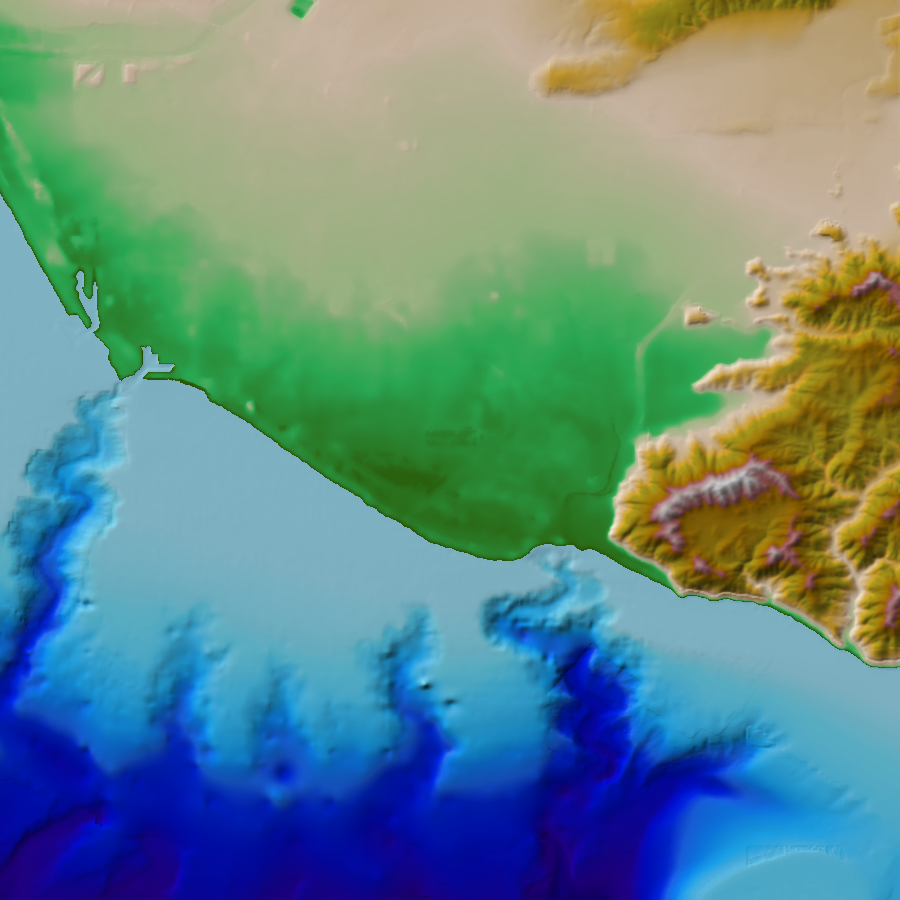
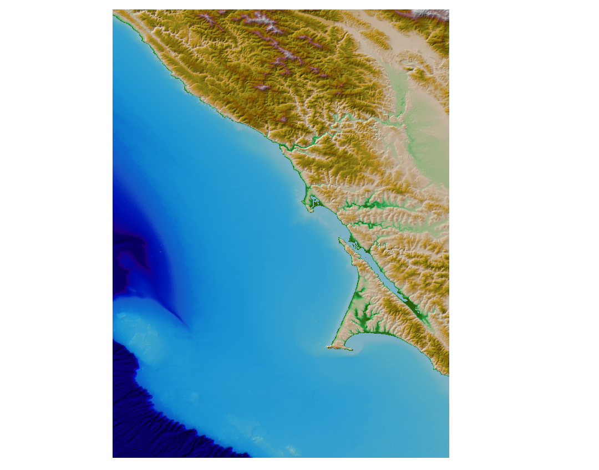
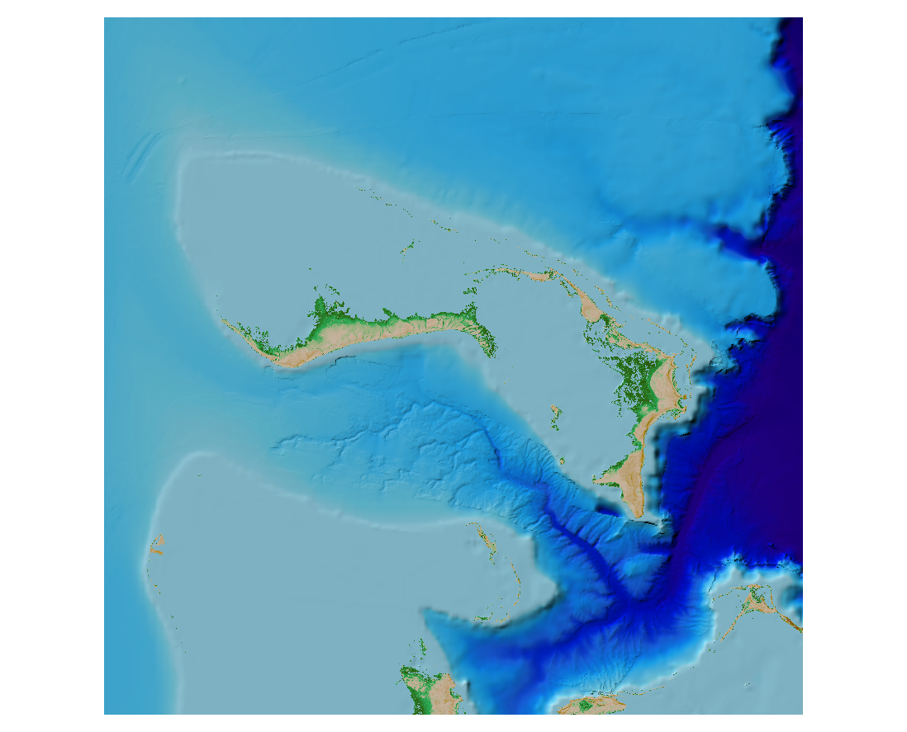
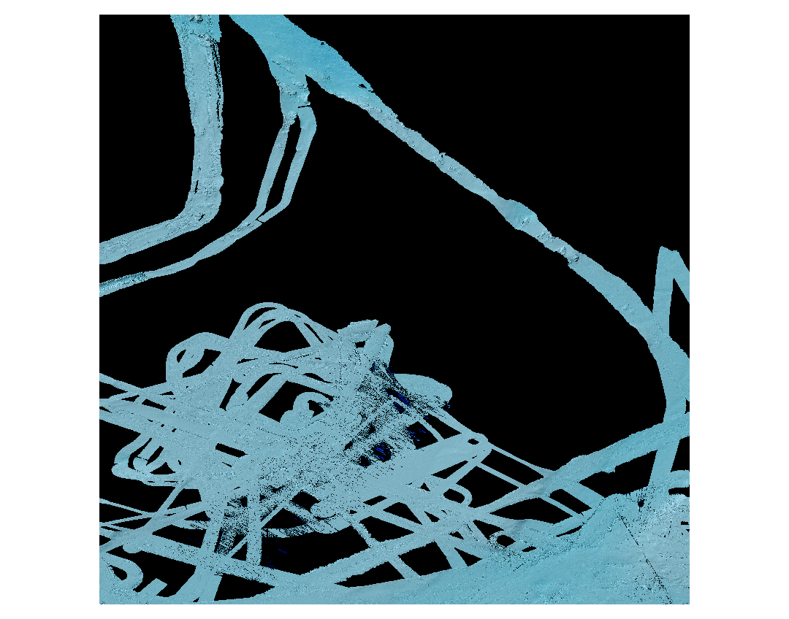

Matthew Love[^1][^2], Christopher Amante[^1][^2]

[^1]: Cooperative Institute for Research in Environmental Sciences (CIRES)
at the University of Colorado Boulder

[^2]: National Oceanic and Atmospheric Administration (NOAA) National
Centers for Environmental Information (NCEI)

# Overview

The National Oceanic and Atmospheric Administration (NOAA) National
Centers for Environmental Information (NCEI), through its collaboration
with the Cooperative Institute for Research in Environmental Sciences
(CIRES) at the University of Colorado Boulder, develops digital
elevation models (DEMs) that range from the local to global scale.
Collectively, these elevation models are essential to determining the
timing and extent of coastal inundation and improving community
preparedness, event forecasting, and warning systems. We initiated a
comprehensive framework at NCEI, the Continuously-Updated DEM (CUDEM)
Program, to systematically generate DEMs from the local coastal
community to the global scale.

We generate the CUDEMs through a standardized process using free and
open-source software (FOSS) and provide open-access to our code
repository
([https://github.com/ciresdem](https://github.com/ciresdem)) for
consistency, transparency, and to promote accessibility. The CUDEM
framework consists of systematic tiled geographic extents, spatial
resolutions, and horizontal and vertical datums to facilitate rapid
updates of targeted areas with new data collections, especially
post-storm and tsunami events. The CUDEM Program is also enabling the
rapid incorporation of high-resolution data collections ingested into
local-scale DEMs into NOAA NCEI's suite of regional and global DEMs. The
CUDEMs are a shift from project-based DEM specifications, to a
comprehensive program that systematically and continuously develops and
updates DEMs across all spatial scales.

# Installation and Setup

## pip
GDAL and GDAL-Python are required for use.

Other useful external programs needed for full functionality include:
GMT, MB-System, HTDP and VDatum.

Installation of the above programs are system dependent. Only GDAL and GDAL-Python are required.

Download and install git (If you have not already): [git installation](https://git-scm.com/book/en/v2/Getting-Started-Installing-Git)

```
pip install git+https://github.com/ciresdem/cudem.git#egg=cudem
```

## conda
- Setup a conda environment and install the dependencies:

```
conda create -n cudem -c conda-forge gdal gmt numpy scipy pandas pyproj utm requests lxml matplotlib laspy h5py boto3 tqdm mercantile git
conda activate cudem
```

- If on Windows, install windows-curses with pip inside conda environment

```
git config --global http.sslVerify false
pip install windows-curses
```

- install HTDP and MB-System

Installation of HTDP and MB-System are system dependent, see their respective installation instructions for your system.

- Install cudem with pip ignoring the dependencies

```
pip install --no-deps git+https://github.com/ciresdem/cudem.git
```

**Main Console Programs provided with CUDEM:**

| Command | Description |
|---|---|
| [dlim](docs/dlim.md) | process data from a variety of data types |
| [waffles](docs/waffles.md) | generate Digital Elevation Models from scattered data using a variety of methods|
| [fetches](docs/fetches.md) | fetch elevation data from a variety of public online sources |
| regions | process REGIONS |
| vdatums | generate vertical transformation grids |
| perspecto | generate images of DEMs |
| grits | filter DEMs |
| cudem   | run CUDEM cli programs and scripts |

# Usage: Data Download, Processing, and DEM Generation

The open-access code includes command-line tools and a Python
application programming interface (API) for automated data download,
processing, DEM gridding, and interpolation uncertainty grid generation
with three main software tools: "fetches", "waffles", and "dlim".
"Fetches" is the data download tool for obtaining publicly available
elevation data froma variety of sources and can optionally list, download or
process thefetched data for use in DEM generation. We download a variety of
data types, e.g., topographic-bathymetry lidar, multibeam swath sonar
bathymetry, hydrographic soundings, compiled grids, etc., from a variety
of sources, e.g., NOAA Office for Coastal Management (OCM) Digital
Coast, NOAA NCEI NOS Hydro Surveys, NOAA NCEI Multibeam, USGS The
National Map, and U.S. Army Corps of Engineers (USACE) Navigation
Condition Surveys. Other data sources include digitized bathymetric
charts or topographic maps, shorelines, satellite-derived elevations,
and precisely surveyed geodetic monuments (Table 1). We typically
download data in an area slightly larger (\~5%) than the DEM extents.
This data "buffer" ensures that interpolative gridding occurs across
rather than along the DEM boundaries to prevent edge effects, which is
especially important with sparse bathymetric data with large
interpolation distances. Data buffers also minimize artificial offsets
between adjacent DEM tiles.

**Table 1.** Data source modules available in the CUDEM software tool
"fetches*.*"

| ***Name***            | ***Description***     | ***URL***             |
|---|---|---|
| arcticdem | Arctic DEM | https://www.pgc.umn.edu/data/arcticdem/ |
| bluetopo | A curated collection of high resolution seafloor models from NOAA. | https://www.nauticalcharts.noaa.gov/data/bluetopo.html |
| buoys | Buoy information from NOAA | https://www.ndbc.noaa.gov |
| charts | NOS Nautical Charts, including electronic Nautical Charts and Raster Nautical Charts | https://www.charts.noaa.gov/ |
| chs | Canadian Hydrographic Surveys | https://open.canada.ca |
| copernicus | Copernicus elevation data | https://ec.europa.eu/eurostat/web/gisco/geodata/reference-data/elevation/copernicus-dem/elevation |
| cpt_city | CPT files from CPT City | http://soliton.vm.bytemark.co.uk/pub/ |
| csb | NOAA Crowd Sourced Bathymetry | https://noaa-dcdb-bathymetry-pds.s3.amazonaws.com |
| digital_coast | Lidar and Raster data from NOAA’s Digital Coast | https://coast.noaa.gov |
| earthdata | NASA Earthdata | https://cmr.earthdata.nasa.gov |
| ehydro | USACE hydrographic surveys | https://navigation.usace.army.mil/Survey/Hydro |
| emodnet | EmodNET European Bathymetric/Topographic DEM | https://portal.emodnet-bathymetry.eu/ |
| etopo | The ETOPO Global Relief Model integrates topography, bathymetry, and shoreline data from regional and global datasets to enable comprehensive, high resolution renderings of geophysical characteristics of the earth’s surface. | https://www.ncei.noaa.gov/products/etopo-global-relief-model |
| fabdem | FABDEM  (Forest And Buildings removed Copernicus DEM) | https://data.bris.ac.uk/data/dataset/s5hqmjcdj8yo2ibzi9b4ew3sn |
| gebco | A global continuous terrain model for ocean and land with a spatial resolution of 15 arc seconds. | https://www.gebco.net/data_and_products/gridded_bathymetry_data/ |
| gmrt | The Global MultiResolution Topography synthesis | https://www.gmrt.org |
| hrdem | High-Resolution DEMs from Canada | https://open.canada.ca |
| hydrolakes | HydroLakes vector and derived elevations | https://www.hydrosheds.org/products/hydrolakes |
| icesat | IceSat2 granules from NASA (requires NASA credentials) | https://cmr.earthdata.nasa.gov |
| mar_grav | Marine Gravity Satellite Altimetry Topography from Scripps. | https://topex.ucsd.edu/WWW_html/mar_grav.html |
| mgds | Marine Geoscience Data System | https://www.marine-geo.org |
| multibeam | NOAA Multibeam bathymetric data | https://data.ngdc.noaa.gov/platforms/ |
| mur_sst | Sea Surface Tempuratures from NASA | https://cmr.earthdata.nasa.gov |
| nasadem | NASA Digital Elevation Model | https://www.earthdata.nasa.gov/esds/competitive-programs/measures/nasadem |
| ncei_thredds | NCEI DEM THREDDS Catalog | https://www.ngdc.noaa.gov/thredds/demCatalog.xml |
| ngs | NGS monuments | http://geodesy.noaa.gov/ |
| nos | NOS Hydrographic DataBase (NOSHDB) | https://www.ngdc.noaa.gov/mgg/bathymetry/hydro.html |
| osm | Open Street Map | https://wiki.openstreetmap.org/ |
| srtm_plus | SRTM15+: Global bathymetry and topography at 15 arc-seconds. | https://topex.ucsd.edu/WWW_html/srtm15_plus.html |
| swot | SWOT data from NASA | https://podaac.jpl.nasa.gov/SWOT?tab=datasets-information |
| tides | Tide station information from NOAA | https://tidesandcurrents.noaa.gov/ |
| tnm | USGS National Map | http://tnmaccess.nationalmap.gov/ |
| trackline | NOAA trackline bathymetry data | http://www.ngdc.noaa.gov/trackline/ |
| usiei | US Interagency Elevation Inventory | https://coast.noaa.gov/inventory/ |
| waterservices | WaterServices station information from USGS | https://waterservices.usgs.gov/ |
| wsf | World Settlement Footprint from DLR (German Aerospace Center) | https://download.geoservice.dlr.de/WSF2019/ |
| vdatum | Vertical Datum transformation grids | https://vdatum.noaa.gov https://cdn.proj.org/ |

"Waffles" is the data gridding tool for DEM generation using various
gridding modules (Table 2). We leverage existing open-source software
packages from a variety of sources including GMT, GDAL, and MB-System.
From these sources, there are also multiple gridding algorithms, e.g.,
spline, inverse distance weighting (IDW), triangulate, average,
near-neighbor, etc. Previous research at NOAA NCEI indicates spline
interpolation is the most accurate gridding algorithm for generating
DEMs (Amante and Eakins, 2016). However, the measurement density and
terrain characteristics (e.g. terrain slope and curvature) may influence
the accuracy of the various gridding algorithms and multiple algorithms
should be evaluated. We then generate DEMs by a combination of data
masking, weighting, and interpolation.

**Table 2.** Gridding modules available in the CUDEM software tool
"waffles."

|  ***Name***          |                ***Description*** |
|----------------------|----------------------------------|
|  gdal-average        |                Generate an average DEM using GDAL\'s *gdal_grid* command. |
|  coastline           |                Generate a coastline (land/sea mask) using a variety of data sources. |
|  cudem               |                CUDEM integrated DEM generation. Generate an topographic-bathymetric integrated DEM using a variety of data sources. |
|  IDW                 |                Generate a DEM using an Inverse Distance Weighted algorithm. If weights are used, will generate a UIDW DEM, using weight values as inverse uncertainty, as described [here](https://ir.library.oregonstate.edu/concern/graduate_projects/79407x932), and [here](https://stackoverflow.com/questions/3104781/inverse-distance-weighted-idw-interpolation-with-python) |
|  gdal-invdst         |                Generate an inverse distance DEM using GDAL\'s *gdal_grid* command. |
|  gdal-linear         |                Generate a linear DEM using GDAL\'s *gdal_grid* command. |
|  mbgrid              |                Generate a DEM using MB-System\'s *mbgrid* command. |
|  gdal-nearest        |                Generate a nearest DEM using GDAL\'s *gdal_grid* command. |
|  gmt-nearneighbor    |                Generate a DEM using GMT\'s *nearneighbor* command |
|  num                 |                Generate an uninterpolated DEM using various gridding modes, including options from GMT's *xyz2grd* command. |
|  linear               |               Generate a DEM using Scipy's linear gridding algorithm) |
|  cubic               |                Generate a DEM using Scipy's cubic gridding algorithm |
|  nearest              |               Generate a DEM using Scipy's nearest gridding algorithm |
|  stacks              |                Generate a DEM using a raster stacking method. By default, calculate the \[weighted\]-mean where overlapping cells occur. Set supercede to True to overwrite overlapping cells with higher weighted data. | 
|  gmt-surface         |               Generate a DEM using GMT\'s *surface* command | 
|  gmt-triangulate     |               Generate a DEM using GMT\'s *triangulate* command | 
|  vdatum              |                Generate a vertical datum conversion grid. |
|  flatten              |               Generate a DEM by flattening nodata areas. |
|  lakes              |               Estimate/interpolate Lake bathymetry. |
|  uncertainty         |               Estimate interpolation uncertainty. |

# Uncertainty Grid Generation

We generate uncertainty grids that represent an estimate of potential
interpolation errors based on a split-sample approach and distance to
the nearest measurement. Using a split-sample approach, a percentage of
the data is omitted, an interpolation method is applied, and the
differences between the interpolated elevations and the original omitted
elevations are calculated. We omit a percentage of the measurements,
apply an interpolation method, and calculate the differences between the
interpolated values and the omitted elevations. We repeat this process
and aggregate the differences between the original measurements and the
interpolated elevations and then we derive a best-fit equation of
interpolation uncertainty as a function of distance to the nearest
measurement.

# Spatial Metadata

We generate spatial metadata for our DEMs that document the data sources
that went into the DEM generation process.

# Examples

## Coastal Releif Model (CRM) at 1 arc-second DEM off the coast of Malibu

Generate a CRM of the Point Mugu area of Malibu using remote datalists provided from fetches.
Datasets included in this example are Marine Gravity (mar_grav), Nautical Charts (charts),
NOS Soundings (hydronos:datatype=xyz), Copernicus (copernicus), USACE surveys (ehydro) and
NOS BAG surveys (hydronos:datatype=bag)

```
waffles -R -119.25/-119/34/34.25 -E 1s -M cudem:pre_count=1:filter_outliers=85:min_weight=.6 -O mugu_crm_test -P epsg:4326+5703 -w -X0:5 mar_grav,-106:bathy_only=True,.001 charts,-200,.01 hydronos:datatype=xyz,-202,.1 copernicus,-103,.6 ehydro,-203,.6 hydronos:datatype=bag,-202,.75
```

Output:

mugu_crm_test.tif

Generate a hillshade of the generated DEM:

```
perspecto -M hillshade mugu_crm_test.tif
```

Output:

mugu_crm_test_hs.tif


**Figure 1.** DEM hillshade generated from CUDEM code example.

## Tiled CRMs in Northern California

Generate a .25 degree tileset for an area in northern California

```
regions -R-123.5/-122.75/37.75/38.75 -T .25
```

Output:

regions_tile_set.shp

Generate DEMs of all the tiles

```
waffles -R regions_tile_set.shp -E 1s -M cudem:pre_count=1:filter_outliers=85:min_weight=.6 -O nocal -P epsg:4326+5703 -p -w -X0:5 mar_grav,-106:bathy_only=True,.001 charts,-200,.01 hydronos:datatype=xyz,-202,.1 copernicus,-103,.6 ehydro,-203,.6
```

Output:

nocal1_n38x00_w123x00_2024v1.tif

nocal1_n38x00_w123x50_2024v1.tif

nocal1_n38x25_w123x25_2024v1.tif

nocal1_n38x50_w123x00_2024v1.tif

nocal1_n38x50_w123x50_2024v1.tif

nocal1_n38x75_w123x25_2024v1.tif

nocal1_n38x00_w123x25_2024v1.tif

nocal1_n38x25_w123x00_2024v1.tif

nocal1_n38x25_w123x50_2024v1.tif

nocal1_n38x50_w123x25_2024v1.tif

nocal1_n38x75_w123x00_2024v1.tif

nocal1_n38x75_w123x50_2024v1.tif

Generate hillshades of all the DEMs, setting min/max z of the CPT so the hillshade edges match:

```
for i in nocal1*v1.tif; do perspecto -M hillshade $i --min_z -360 --max_z 800; done
```


**Figure 2.** DEM hillshade generated from CUDEM code example.

## DEM and Uncertainty for the Bahamas

We provide an example of code to download and process depth and
elevation data from the "gebco", "copernicus", and "mar_grav" data
sources in Table 1, and then generate a DEM and accompanying
interpolation uncertainty grid. First, we download all the data, and
then process the data by masking out GEBCO data where TID is equal to 0
(Land) or 40 (Predicted based on satellite-derived gravity data - depth
value is an interpolated value guided by satellite-derived gravity
data). See the GEBCO Cookbook chapter on GEBCO TID generation for more
information.

We then stack the raster data sources with higher weighted datasets
masking out lower weighted datasets and apply spline interpolation to
the bathymetry by limiting the interpolation to an upper limit value of
zero and clipping the resulting grid to an automatically generated
coastline from the Copernicus data.

Lastly, we combine this bathymetric surface with the other data sources
that have a weighting above the min_weight specification (in this
example, min_weight=.15), and apply spline interpolation with a weighted
averages of these data sources to generate the final integrated
bathymetric-topographic DEM.

**To generate the configuration file that is then used to generate the
15 arc-second resolution DEM and the interpolation uncertainty grid,
execute the following command:**

```
waffles -R -79.5/-76.5/25/28 -E 15s -O gebcop -p -w -m -P epsg:4326 -M cudem:min_weight=.15:landmask=True:pre_count=1 gebco,-102:exclude_tid=0/40,.015 copernicus,-103,10 mar_grav,-106:bathy_only=True,.001 gmrt,-101:swath_only=True,1.5 --config
```

The contents of the generated config file configuration file
(gebcop15_n28x00_w079x50_2023v1.json) are as follows:

```
{
    "mod": "cudem:min_weight=.15:landmask=True:pre_count=1",
    "mod_name": "cudem",
    "mod_args": {
        "min_weight": ".15",
        "landmask": true,
        "pre_count": "1"
    },
    "kwargs": {
        "verbose": true,
        "sample": "bilinear",
        "xsample": null,
        "ysample": null,
        "dst_srs": "epsg:4326",
        "srs_transform": false,
        "fltr": [],
        "name": "gebcop15_n28x00_w079x50_2023v1",
        "cache_dir": "/home/ncei/Projects/crm/software/.cudem_cache",
        "ndv": -9999,
        "xinc": 0.004166666666666667,
        "yinc": 0.004166666666666667,
        "want_weight": true,
        "want_mask": true,
        "data": [
            "gebco,-102:exclude_tid=0/40,.015,0",
            "copernicus,-103,10,0",
            "mar_grav,-106:bathy_only=True,.001,0",
            "gmrt,-101:swath_only=True,1.5,0"
        ],
        "src_region": [
            -79.5,
            -76.5,
            25.0,
            28.0
        ]
    }
}
```

**To generate the DEM, execute the following command:**

```
waffles -G gebcop15_n28x00_w079x50_2023v1.json
```

Output:

gebcop3_n28x00_w079x50_2023v1.json - json config file

gebcop3_n28x00_w079x50_2023v1_msk.tif - data mask

gebcop3_n28x00_w079x50_2023v1_stack.tif - stacks data \'stacked\'
output

gebcop3_n28x00_w079x50_2023v1_u.tif - uncertainty grid

gebcop3_n28x00_w079x50_2023v1.tif - final DEM



**Figure 3.** Final DEM generated from CUDEM code example.


**Figure 4.** Interpolation uncertainty grid generated from the best-fit
interpolation uncertainty equation applied to the distance to the
nearest measurement raster.

## Automatic gridding and filtering of Multibeam data

First, we use the 'multibeam' fetches module as a datalist entry in a waffles command to fetch and grid the
multibeam data in our region, the using that result as a datalist entry in a waffles command to grid the data
using the 'IDW' waffles gridding module.

```
waffles -R-123.25/-123/48.25/48.5 -E .11111111s -O mb -p -P epsg:4326 -m -u -M stacks multibeam
```

```
waffles -R-123.25/-123/48.25/48.5 -E .11111111s -O mb_idw -p -P epsg:4326 -m -u -M IDW:radius=10 mb19_n48x50_w123x25_2024v1.tif
```



**Figure 5.** Auto-gridded raw multibeam data

The above results show some major artifacts from the raw multibeam data, so we then filter that output using
the grits 'outlier' filter and re-generate the IDW grid with waffles:

```
grits mb19_n48x50_w123x25_2024v1_filtered.tif -M outliers
```

```
waffles $(dlim -r mb19_n48x50_w123x25_2024v1.tif) -M IDW:radius=5 -O mb_idw -E .11111111s -p -P epsg:4326 mb_data19_n_w_filtered.tif
```


**Figure 6.** Auto-grided filtered multibeam data

We can combine all the above steps using a single waffles command to fetch the multibeam, filter it using the
grits 'outlier' module with the waffles -T switch and generate an IDW DEM with the waffles 'IDW' module.

```
waffles -R-123.25/-123/48.25/48.5 -E .11111111s -O mb -p -P epsg:4326 -m -u -M IDW:radius=10 -T outliers:stacks=True multibeam
```

# Additional Information

The CUDEM code repository is frequently updated, and code syntax is
subject to change. Please see the code help function for the latest code
syntax and examples. See Eakins and Grothe (2014) for more information
on the challenges of building integrated DEMs and Eakins et al. (2015)
for the initial specifications of the comprehensive DEM development
framework. See Hare et al. (2011), Amante and Eakins (2016), and Amante
(2018) for additional information on the DEM uncertainty.

For additional questions, please contact:

[Matthew.Love@noaa.gov](mailto:Matthew.Love@noaa.gov)

[Christopher.Amante@noaa.gov](mailto:Christopher.Amante@noaa.gov)

## License

License:

  -----------------------------------------------------------------------
         MIT License
  -----------------------------------------------------------------------
         
         Copyright (c) 2010 - 2023 Regents of the University of Colorado
         
         Permission is hereby granted, free of charge, to any person
         obtaining a copy
         of this software and associated documentation files (the
         \"Software\"), to deal
         in the Software without restriction, including without
         limitation the rights
         to use, copy, modify, merge, publish, distribute, sublicense,
         and/or sell
         copies of the Software, and to permit persons to whom the
         Software is
         furnished to do so, subject to the following conditions:
      
         The above copyright notice and this permission notice shall be
         included in all
         copies or substantial portions of the Software.
         
         THE SOFTWARE IS PROVIDED \"AS IS\", WITHOUT WARRANTY OF ANY
         KIND, EXPRESS OR
         IMPLIED, INCLUDING BUT NOT LIMITED TO THE WARRANTIES OF
         MERCHANTABILITY,
         FITNESS FOR A PARTICULAR PURPOSE AND NONINFRINGEMENT. IN NO
         EVENT SHALL THE
         AUTHORS OR COPYRIGHT HOLDERS BE LIABLE FOR ANY CLAIM, DAMAGES OR
         OTHER
         LIABILITY, WHETHER IN AN ACTION OF CONTRACT, TORT OR OTHERWISE,
         ARISING FROM,
         OUT OF OR IN CONNECTION WITH THE SOFTWARE OR THE USE OR OTHER
         DEALINGS IN THE
         SOFTWARE.
  -----------------------------------------------------------------------

## Code Citation

Love, M., Amante, C., Carignan, K., MacFerrin, M., & Lim, E. (2023).
CUDEM (Version 1.10.5) \[Computer software\].
[[https://github.com/ciresdem/cudem]{.ul}](https://github.com/ciresdem/cudem)

# References

Amante CJ, Love M, Carignan K, Sutherland MG, MacFerrin M, Lim E. Continuously Updated Digital Elevation Models (CUDEMs) to Support Coastal Inundation Modeling. Remote Sensing. 2023; 15(6):1702. https://doi.org/10.3390/rs15061702

Amante, C. J. (2018). Estimating coastal digital elevation model
uncertainty. Journal of Coastal Research, 34(6), 1382-1397. https://doi.org/10.2112/JCOASTRES-D-17-00211.1

Amante, C. J., & Eakins, B. W. (2016). Accuracy of interpolated
bathymetry in digital elevation models. Journal of Coastal Research, (76
(10076)), 123-133. https://doi.org/10.2112/SI76-011

Eakins, B. W., & Grothe, P. R. (2014). Challenges in building coastal
digital elevation models. Journal of Coastal Research, 30(5), 942-953.

Eakins, B. W., Danielson, J. J., Sutherland, M. G., & Mclean, S. J.
(2015). A framework for a seamless depiction of merged bathymetry and
topography along US coasts. In Proc. US Hydro. Conf (pp. 16-19).

Hare, R., Eakins, B., & Amante, C. J. (2011). Modelling bathymetric
uncertainty. The International Hydrographic Review.