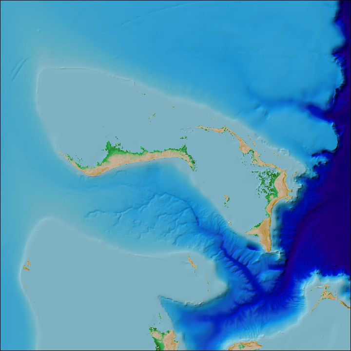
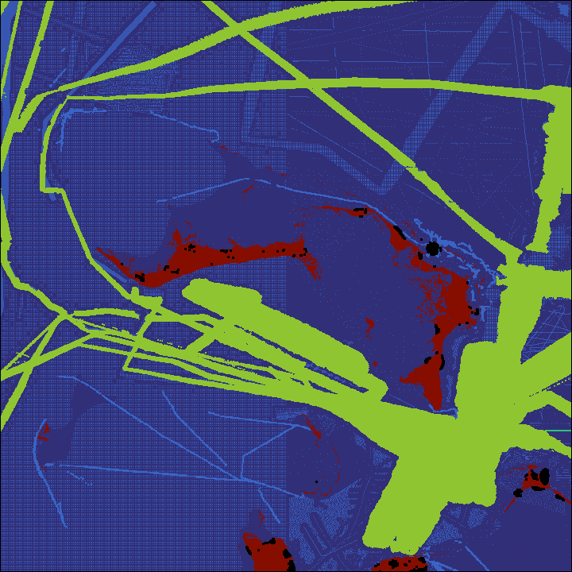
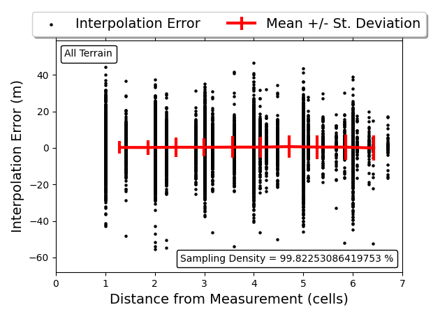
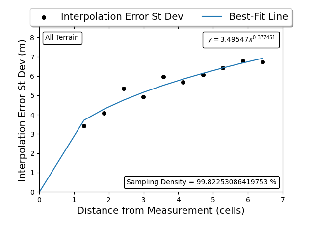
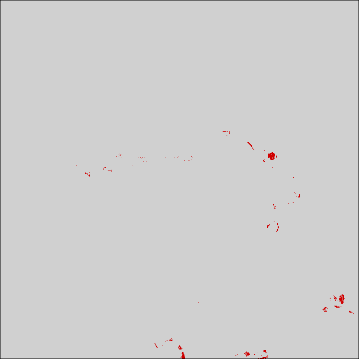

Matthew Love[^1][^2], Christopher Amante[^1][^2]

[^1]: Cooperative Institute for Research in Environmental Sciences (CIRES)
at the University of Colorado Boulder

[^2]: National Oceanic and Atmospheric Administration (NOAA) National
Centers for Environmental Information (NCEI)

# Overview

The National Oceanic and Atmospheric Administration (NOAA) National
Centers for Environmental Information (NCEI), through its collaboration
with the Cooperative Institute for Research in Environmental Sciences
(CIRES) at the University of Colorado Boulder, develops digital
elevation models (DEMs) that range from the local to global scale.
Collectively, these elevation models are essential to determining the
timing and extent of coastal inundation and improving community
preparedness, event forecasting, and warning systems. We initiated a
comprehensive framework at NCEI, the Continuously-Updated DEM (CUDEM)
Program, to systematically generate DEMs from the local coastal
community to the global scale.

We generate the CUDEMs through a standardized process using free and
open-source software (FOSS) and provide open-access to our code
repository
([https://github.com/ciresdem](https://github.com/ciresdem)) for
consistency, transparency, and to promote accessibility. The CUDEM
framework consists of systematic tiled geographic extents, spatial
resolutions, and horizontal and vertical datums to facilitate rapid
updates of targeted areas with new data collections, especially
post-storm and tsunami events. The CUDEM Program is also enabling the
rapid incorporation of high-resolution data collections ingested into
local-scale DEMs into NOAA NCEI's suite of regional and global DEMs. The
CUDEMs are a shift from project-based DEM specifications, to a
comprehensive program that systematically and continuously develops and
updates DEMs across all spatial scales.

In this section, we provide user instructions to:

-   Install the CUDEM code and the open-source software dependencies
-   Download and process elevation and depth data from multiple publicly available sources
-   Generate an integrated coastal bathymetric-topographic DEM
-   Generate an interpolation uncertainty grid

# Code Repository Install

**Dependencies:**

Required:
-   Python \>= 3.0
-   GDAL
-   GDAL-Python
-   git
-   pip

Optional:
-   GMT
-   MB-System
-   HTDP
-   VDatum

Python libraries (installed with pip when using the 'install_CUDEM.py' script):
-   numpy
-   scipy
-   requests[security]
-   lxml
-   matplotlib
-   laspy[laszip]
-   h5py
-   boto3

**Install CUDEM and dependencies from github using git (on
Redhat/Fedora):**

```
sudo dnf update
git config --global user.name "First Last"
git config --global user.email "example@example.com"
git clone https://github.com/ciresdem/cudem.git
cd cudem
python install_CUDEM.py --dependencies
```

**Update existing CUDEM installation via git:**

`python install_CUDEM.py --pull`

**Install Dependencies and CUDEM code Manually on Redhat/Fedora (package names will differ on other linux systems):**

*Install GDAL:*

`sudo dnf install gdal gdal-devel python3-gdal`

*Install GMT:*

`sudo dnf install GMT GMT-devel GMT-doc gshhg-gmt-nc4 gshhg-gmt-nc4-full gshhg-gmt-nc4-high`

*Install MB-System:*

> *https://www.mbari.org/products/research-software/mb-system/how-to-download-and-install-mb-system/#toggle-id-10*

```
sudo dnf install openmotif openmotif-devel fftw fftw-devel netcdf netcdf-devel proj proj-devel gdal-devel gmt gmt-devel boost boost-python3 glibc-devel mesa\* xorg-x11-fonts\* gcc-c++ libtirpc-devel
git clone https://github.com/dwcaress/MB-System.git
cd MB-System
./configure --prefix \~/.local CFLAGS=\"-I/usr/include/tirpc\"
CXXFLAGS=\"-I/usr/include/tirpc\"
make
make install
```

*Install HTDP:*

```
sudo dnf install gfortran
wget https://geodesy.noaa.gov/TOOLS/Htdp/HTDP-download.zip
unzip HTDP-download.zip -d htdp_tmp
gfortran htdp_tmp/htdp.f
mv a.out ~/.local/bin/htdp
```

*Install CUDEM git:*

```
sudo dnf install python3-gdal python3-pip python3-wheel
git clone https://github.com/ciresdem/cudem.git
cd cudem
./install_CUDEM.py
# Add the following to \~/.bashrc
export PATH=\~/.local/bin:\$PATH
source \~/.bashrc
```

**Programs and scripts provided with CUDEM:**

| Command | Description |
|---|---|
| dlim | process data |
| waffles | generate Digital Elevation Models |
| regions | process REGIONS |
| fetches | fetch elevation data |
| spatial_metadata | generate spatial metadata |
| uncertainties | calculate DEM uncertainties |
| bag2tif2chunks2xyz.sh | convert a BAG to chunked XYZ |
| clip_xyz.sh | clip an xyz file based on a vector |
| coastline2xyz.sh | convert a coastline vector to XYZ |
| colortable.py | generate a colortable |
| create_datalist.sh | create a datalist from data in the current directory |
| create_outliers.sh | identify outliers in a DEM |
| create_povray_template.sh | generate a POVray template from a DEM |
| create_coastline.py | generate a coastline |
| ddms.py | convert between dd and dms |
| error_distance_plots.py | generate an error/distance plots |
| gdal_null.py | generate a null grid |
| gdal_outliers.py | filter vertical outliers from a grid |
| gdal_nan2null.py | convert NaN values from a grid |
| gdal_findreplace.py | find/replace values in a grid |
| gdal_query.py | query values from a grid |
| gdal_chunk.py | parse a grid into chunks |
| gdal_crop.py | crop a grid by its nodata value |
| gdal_cut.py | cut a grid to a given region |
| gdal_clip.py | clip a grid to a vector |
| gdal_split.py | split a grid by z value |
| gdal_percentile.py | get a percentile from a grid |
| gdal_histogram.py | generate a histogram from a grid |
| gdal_hillshade.py | generate a hillshade image from a grid |
| gdal_minmax.py | get min/max values from a grid |
| gdal_mask.py | generate a gdal mask grid |
| grd2mesh.py | generate an unstructured grid |
| has_nulls.py | check if a grid has nodata values |
| hillshade.sh | generate a hillshade from a DEM |
| nsidc_download.py | downlaod nsidc data |
| ogr_edit_field.py | edit OGR field values |
| outliers_shp.sh | identify outliers in a DEM |
| percentiles_minmax.py | get percentiles from a grid |
| rename_shp.py | rename a shapefile |
| smooth_dem_bathy.py | smooth a DEM \< 0 with a Gaussian filter |
| spatial-meta.sh | generate spatial metadata using BOUNDS |
| tif2chunks2xyz.sh | chunk a DEM and output as chunked XYZ |
| usace_interp.sh | interpolate usace cross surveys |
| vdatum_cmd.py | run NOAAs vdatum from command-line |
| x360.py | flip a DEM |
| xyz_clip.py | clip an xyz file based on a raster mask |
| xyztindex.py | generate a tile index of xyz files. |
| update_dem.sh | update a DEM with new data. |
| vrbag2tif2chunks2xyz.sh | convert and chunk a VR BAG |
| explode_bags.sh | extract all supergrids from a BAG |
| vertical_datum_convert.py | transform the vertical datum of a DEM. |

# Data Download, Processing, and DEM Generation

The open-access code includes command-line tools and a Python
application programming interface (API) for automated data download,
processing, DEM gridding, and interpolation uncertainty grid generation
with two main software tools: "fetches" and "waffles". "Fetches" is the
data download tool for obtaining publicly available elevation data from
a variety of sources and can optionally list, download or process the
fetched data for use in DEM generation. We download a variety of data
types, e.g., topographic-bathymetry lidar, multibeam swath sonar
bathymetry, hydrographic soundings, compiled grids, etc., from a variety
of sources, e.g., NOAA Office for Coastal Management (OCM) Digital
Coast, NOAA NCEI NOS Hydro Surveys, NOAA NCEI Multibeam, USGS The
National Map, and U.S. Army Corps of Engineers (USACE) Navigation
Condition Surveys. Other data sources include digitized bathymetric
charts or topographic maps, shorelines, satellite-derived elevations,
and precisely surveyed geodetic monuments (Table 1). We typically
download data in an area slightly larger (\~5%) than the DEM extents.
This data "buffer" ensures that interpolative gridding occurs across
rather than along the DEM boundaries to prevent edge effects, which is
especially important with sparse bathymetric data with large
interpolation distances. Data buffers also minimize artificial offsets
between adjacent DEM tiles.

**Table 1.** Data source modules available in the CUDEM software tool
"fetches*.*"

| ***Name***            | ***Description***     | ***URL***             |
|---|---|---|
| arcticdem | Arctic DEM | https://www.pgc.umn.edu/data/arcticdem/ |
| bluetopo | A curated collection of high resolution seafloor models from NOAA. | https://www.nauticalcharts.noaa.gov/data/bluetopo.html |
| buoys | Buoy information from NOAA | https://www.ndbc.noaa.gov |
| charts | NOS Nautical Charts, including electronic Nautical Charts and Raster Nautical Charts | https://www.charts.noaa.gov/ |
| chs | Canadian Hydrographic Surveys | https://open.canada.ca |
| copernicus | Copernicus elevation data | https://ec.europa.eu/eurostat/web/gisco/geodata/reference-data/elevation/copernicus-dem/elevation |
| digital_coast | Lidar and Raster data from NOAA’s Digital Coast | https://coast.noaa.gov |
| earthdata | NASA Earthdata | https://cmr.earthdata.nasa.gov |
| ehydro | USACE hydrographic surveys | https://navigation.usace.army.mil/Survey/Hydro |
| emodnet | EmodNET European Bathymetric/Topographic DEM | https://portal.emodnet-bathymetry.eu/ |
| gebco | A global continuous terrain model for ocean and land with a spatial resolution of 15 arc seconds. | https://www.gebco.net/data_and_products/gridded_bathymetry_data/ |
| gmrt | The Global MultiResolution Topography synthesis | https://www.gmrt.org |
| hrdem | High-Resolution DEMs from Canada | https://open.canada.ca |
| hydrolakes | HydroLakes vector and derived elevations | https://www.hydrosheds.org/products/hydrolakes |
| mar_grav | Marine Gravity Satellite Altimetry Topography from Scripps. | https://topex.ucsd.edu/WWW_html/mar_grav.html |
| mgds | Marine Geoscience Data System | https://www.marine-geo.org |
| multibeam | NOAA Multibeam bathymetric data | https://data.ngdc.noaa.gov/platforms/ |
| nasadem | NASA Digital Elevation Model | https://www.earthdata.nasa.gov/esds/competitive-programs/measures/nasadem |
| ncei_thredds | NCEI DEM THREDDS Catalog | https://www.ngdc.noaa.gov/thredds/demCatalog.xml |
| ngs | NGS monuments | http://geodesy.noaa.gov/ |
| nos | NOS Hydrographic DataBase (NOSHDB) | https://www.ngdc.noaa.gov/mgg/bathymetry/hydro.html |
| osm | Open Street Map | https://wiki.openstreetmap.org/ |
| srtm_plus | SRTM15+: Global bathymetry and topography at 15 arc-seconds. | https://topex.ucsd.edu/WWW_html/srtm15_plus.html |
| tides | Tide station information from NOAA | https://tidesandcurrents.noaa.gov/ |
| tnm | USGS National Map | http://tnmaccess.nationalmap.gov/ |
| trackline | NOAA trackline bathymetry data | http://www.ngdc.noaa.gov/trackline/ |
| usiei | US Interagency Elevation Inventory | https://coast.noaa.gov/inventory/ |
| vdatum | Vertical Datum transformation grids | https://vdatum.noaa.gov https://cdn.proj.org/ |


"Waffles" is the data gridding tool for DEM generation using various
gridding modules (Table 2). We leverage existing open-source software
packages from a variety of sources including GMT, GDAL, and MB-System.
From these sources, there are also multiple gridding algorithms, e.g.,
spline, inverse distance weighting (IDW), triangulate, average,
near-neighbor, etc. Previous research at NOAA NCEI indicates spline
interpolation is the most accurate gridding algorithm for generating
DEMs (Amante and Eakins, 2016). However, the measurement density and
terrain characteristics (e.g. terrain slope and curvature) may influence
the accuracy of the various gridding algorithms and multiple algorithms
should be evaluated. We then generate DEMs by a combination of data
masking, weighting, and interpolation.

**Table 2.** Gridding modules available in the CUDEM software tool
"waffles."

|  ***Name***          |                ***Description*** |
|----------------------|----------------------------------|
|  average             |                Generate an average DEM using GDAL\'s *gdal_grid* command. |
|  coastline           |                Generate a coastline (land/sea mask) using a variety of data sources. |
|  cudem               |                CUDEM integrated DEM generation. Generate an topographic-bathymetric integrated DEM using a variety of data sources. |
|  IDW                 |                Generate a DEM using an Inverse Distance Weighted algorithm. If weights are used, will generate a UIDW DEM, using weight values as inverse uncertainty, as described [here](https://ir.library.oregonstate.edu/concern/graduate_projects/79407x932), and [here](https://stackoverflow.com/questions/3104781/inverse-distance-weighted-idw-interpolation-with-python) |
|  invdst              |                Generate an inverse distance DEM using GDAL\'s *gdal_grid* command. |
|  linear              |                Generate a linear DEM using GDAL\'s *gdal_grid* command. |
|  mbgrid              |                Generate a DEM using MB-System\'s *mbgrid* command. |
|  nearest             |                Generate a nearest DEM using GDAL\'s *gdal_grid* command. |
|  nearneighbor        |                Generate a DEM using GMT\'s *nearneighbor* command |
|  num                  |               Generate an uninterpolated DEM using various gridding modes, including options from GMT's *xyz2grd* command |
|  stacks               |               Generate a DEM using a raster stacking method. By default, calculate the \[weighted\]-mean where overlapping cells occur. Set supercede to True to overwrite overlapping cells with higher weighted data. | 
|  surface              |               Generate a DEM using GMT\'s *surface* command | 
|  triangulate          |               Generate a DEM using GMT\'s *triangulate* command | 
|  vdatum              |                Generate a vertical datum conversion grid. |

# Uncertainty Grid Generation

We generate uncertainty grids that represent an estimate of potential
interpolation errors based on a split-sample approach and distance to
the nearest measurement. Using a split-sample approach, a percentage of
the data is omitted, an interpolation method is applied, and the
differences between the interpolated elevations and the original omitted
elevations are calculated. We omit a percentage of the measurements,
apply an interpolation method, and calculate the differences between the
interpolated values and the omitted elevations. We repeat this process
and aggregate the differences between the original measurements and the
interpolated elevations and then we derive a best-fit equation of
interpolation uncertainty as a function of distance to the nearest
measurement.

# Code Example

We provide an example of code to download and process depth and
elevation data from the "gebco", "copernicus", and "mar_grav" data
sources in Table 1, and then generate a DEM and accompanying
interpolation uncertainty grid. First, we download all the data, and
then process the data by masking out GEBCO data where TID is equal to 0
(Land) or 40 (Predicted based on satellite-derived gravity data - depth
value is an interpolated value guided by satellite-derived gravity
data). See the GEBCO Cookbook chapter on GEBCO TID generation for more
information.

We then stack the raster data sources with higher weighted datasets
masking out lower weighted datasets and apply spline interpolation to
the bathymetry by limiting the interpolation to an upper limit value of
zero and clipping the resulting grid to an automatically generated
coastline from the Copernicus data.

Lastly, we combine this bathymetric surface with the other data sources
that have a weighting above the min_weight specification (in this
example, min_weight=.15), and apply spline interpolation with a weighted
averages of these data sources to generate the final integrated
bathymetric-topographic DEM.

**To generate the configuration file that is then used to generate the
15 arc-second resolution DEM and the interpolation uncertainty grid,
execute the following command:**

```
waffles -R -79.5/-76.5/25/28 -E 15s -O gebcop -p -w -m -P epsg:4326 -M cudem:min_weight=.15:landmask=coastline:pre_count=1:keep_auxilary=True gebco:exclude_tid=0/40,-11,1 copernicus:datatype=1,-11,2 mar_grav:raster=True:upper_limit=0,-11,.01 \--config
```

The contents of the generated config file configuration file
(gebcop15_n28x00_w079x50_2022v1.json) are as follows:

```
{
"archive": false,
"block": false,
"cache_dir": ".cudem_cache",
"chunk": null,
"clip": null,
"clobber": true,
"data": [
	"gebco:exclude_tid=0/40,-11,1.0",
	"copernicus:datatype=1,-11,2.0",
	"mar_grav:raster=True:upper_limit=0,-11,.01"
],
"dst_srs": "epsg:4326",
"extend": 0,
"extend_proc": 0,
"fltr": [],
"fmt": "GTiff",
"mask": true,
"mod": "cudem:min_weight=.2:landmask=coastline:pre_count=1",
"name": "gebcop15_n28x00_w079x50_2022v1",
"ndv": -9999,
"node": "pixel",
"sample": "bilinear",
"spat": false,
"src_region": [
	      -79.5,
	      -76.5,
	      25.0,
	      28.0,
	      null,
	      null,
	      null,
	      null
],
"srs_transform": false,
"verbose": true,
"weights": 1,
"xinc": 0.004166666666666667,
"xsample": null,
"yinc": 0.004166666666666667,
"ysample": null
}
```

**To generate the DEM, execute the following command:**

`waffles -G gebcop15_n28x00_w079x50_2022v1.json`

Output:

gebcop15_n28x00_w079x50_2022v1_cst.dbf - coast mask

gebcop15_n28x00_w079x50_2022v1_cst.prj - coast mask

gebcop15_n28x00_w079x50_2022v1_cst.shp - coast mask

gebcop15_n28x00_w079x50_2022v1_cst.shx - coast mask

gebcop15_n28x00_w079x50_2022v1_cst.tif - coast mask

gebcop15_n28x00_w079x50_2022v1.json - json config file

gebcop15_n28x00_w079x50_2022v1_m.tif - data mask

gebcop15_n28x00_w079x50_2022v1_stack_c.tif - stacks \'count\' output

gebcop15_n28x00_w079x50_2022v1_stack_s.tif - stacks data \'stacked\'
output

gebcop15_n28x00_w079x50_2022v1_stack_w.tif - stacks weight mask

gebcop15_n28x00_w079x50_2022v1.tif - final DEM



**Figure 1.** Final DEM generated from CUDEM code example.



**Figure 2.** DEM data source mask.

**To generate the Interpolation Uncertainty Grid, execute the following
command:**

`uncertainties gebcop15_n28x00_w079x50_2022v1.json`

Output:

gebcop15_n28x00_w079x50_2022v1_prox_bf.png - uncertainty best fit

gebcop15_n28x00_w079x50_2022v1_prox_scatter.png - uncertainty scatter

gebcop15_n28x00_w079x50_2022v1_prox_unc.tif - uncertainty grid



**Figure 3.** Split-sample interpolation errors as a function of
distance to the nearest measurement.



**Figure 4.** Best-fit interpolation uncertainty equation derived from
the standard deviations of binned split-sample interpolation errors as a
function of distance to the nearest measurement.



**Figure 5.** Interpolation uncertainty grid generated from the best-fit
interpolation uncertainty equation applied to the distance to the
nearest measurement raster.

# Additional Information

The CUDEM code repository is frequently updated, and code syntax is
subject to change. Please see the code help function for the latest code
syntax and examples. See Eakins and Grothe (2014) for more information
on the challenges of building integrated DEMs and Eakins et al. (2015)
for the initial specifications of the comprehensive DEM development
framework. See Hare et al. (2011), Amante and Eakins (2016), and Amante
(2018) for additional information on the DEM uncertainty.

For additional questions, please contact:

[[Matthew.Love\@noaa.gov]{.ul}](mailto:Matthew.Love@noaa.gov)

[[Christopher.Amante\@noaa.gov]{.ul}](mailto:Christopher.Amante@noaa.gov)

## Code Syntax

### Fetches Module:
```
fetches (0.7.6): Fetches; Fetch and process remote elevation data

usage: fetches [ -hlmpqERW [ args ] ] MODULE ...

Options:
-R, \--region Restrict processing to the desired REGION
    Where a REGION is xmin/xmax/ymin/ymax[/zmin/zmax[/wmin/wmax]]
    Use '-' to indicate no bounding range; e.g. -R -/-/-/-/-10/10/1/-
    OR an OGR-compatible vector file with regional polygons.
    Where the REGION is /path/to/vector[:zmin/zmax[/wmin/wmax]].
    If a vector file is supplied, will use each region found therein.
-W, --t_srs Set the TARGET projection (for use with '-p').
-E, --increment Block data to INCREMENT in native units.
    Where INCREMENT is x-inc[/y-inc] (for use with '-p').
-H, --threads Set the number of threads (1)
-l, --list Return a list of fetch URLs in the given region.
-p, --process Process fetched elevation data to ASCII XYZ format. <beta>
-z, --no_check_size Don\'t check the size of remote data if local data exists.
-q, --quiet Lower the verbosity to a quiet

--modules Display the module descriptions and usage
--help Print the usage text
--version Print the version information

Supported FETCHES modules (see fetches --modules <module-name> for more info):

gmrt, gebco, srtm_plus, mar_grav, multibeam, mgds, trackline, ehydro,
ngs, nos, charts, digital_coast, ncei_thredds, tnm, emodnet, chs, hrdem,
arcticdem, bluetopo, osm, copernicus, nasadem, tides, vdatum, buoys,
earthdata, usiei, hydrolakes
```

### Waffles Module:
```
waffles (1.9.0): Generate DEMs and derivatives.

usage: waffles \[OPTIONS\] DATALIST

Options:
-R, --region Specifies the desired REGION;
    Where a REGION is xmin/xmax/ymin/ymax[/zmin/zmax[/wmin/wmax]]
    Use '-' to indicate no bounding range; e.g. -R -/-/-/-/-10/10/1/-
    OR an OGR-compatible vector file with regional polygons.
    Where the REGION is /path/to/vector[:zmin/zmax[/wmin/wmax]].
    If a vector file is supplied, will use each region found therein.
-E, --increment Gridding INCREMENT and RESAMPLE-INCREMENT in native
    units.
    Where INCREMENT is x-inc[/y-inc][:sample-x-inc/sample-y-inc]
-S, --sample_alg ReSAMPLE algorithm to use (from gdalwarp)
-F, --format Output grid FORMAT. [GTiff]
-M, --module Desired Waffles MODULE and options. (see available Modules
    below)
    Where MODULE is
    module[:mod_opt=mod_val[:mod_opt1=mod_val1[:...]]]
-O, --output-name BASENAME for all outputs.
-P, --t_srs Projection of REGION and output DEM.
-X, --extend Number of cells with which to EXTEND the output DEM REGION and a
    percentage to extend the processing REGION.
    Where EXTEND is dem-extend(cell-count)\[:processing-extend(percentage)\]
    e.g. -X6:10 to extend the DEM REGION by 6 cells and the processing
    region by 10 percent of the input REGION.
-T, --filter FILTER the output DEM using one or multiple filters.
    Where FILTER is fltr_id[:fltr_val[:split_value=z]]
    Available FILTERS:
    1: perform a Gaussian Filter at -T1:<factor>.
    2: use a Cosine Arch Filter at -T2:<dist(km)> search distance.
    3: perform an Outlier Filter at -T3:<aggression>.
       The -T switch may be set multiple times to perform multiple filters.
       Append :split_value=<num> to only filter values below z-value <num>.
       e.g. -T1:10:split_value=0 to smooth bathymetry (z<0) using Gaussian
       filter
-C, --clip CLIP the output to the clip polygon
    -C<clip_ply.shp:invert=False>
-K, --chunk Generate the DEM in CHUNKs
-G, --wg-config A waffles config JSON file. If supplied, will overwrite all other options.
    Generate a waffles_config JSON file using the --config flag.
-D, --cache-dir CACHE Directory for storing temp data.
    Default Cache Directory is ~/.cudem_cache; cache will be cleared
    after a waffles session to retain the data, use the --keep-cache flag
-N, --nodata NODATA value of output DEM
-f, --transform Transform all data to PROJECTION value set with
--t_srs/-P where applicable.
-p, --prefix Set BASENAME (-O) to PREFIX (append
    <RES>_nYYxYY_wXXxXX_<YEAR>v<VERSION> info to output BASENAME).
    note: Set Resolution, Year and Version by setting this to
    'res=X:year=XXXX:version=X', leave blank for default of
    <INCREMENT>, <CURRENT_YEAR> and <1>, respectively.
-r, --grid-node Use grid-node registration, default is pixel-node
-w, --weights Use weights provided in the datalist to weight overlapping data.
-a, --archive ARCHIVE the datalist to the given region.
-k, --keep-cache KEEP the cache data intact after run
-m, --mask Generate a data MASK raster.
-s, --spat Generate SPATIAL-METADATA.
-c, --continue Don\'t clobber existing files.
-q, --quiet Lower verbosity to a quiet.

--help Print the usage text
--config Save the waffles config JSON and major datalist
--modules Display the module descriptions and usage
--version Print the version information

Datalists and data formats:
A datalist is a file that contains a number of datalist entries, while
an entry is a space-delineated line: \`path \[format weight \[name
source date type resolution hdatum vdatum url\]\]\`

Supported datalist formats:
datalist (-1), zip (-2), xyz (168), raster (200), bag (201), las (300),
mbs (301), fetches (-11)

Modules (see waffles \--modules \<module-name> for more info):
surface, triangulate, nearneighbor, num, linear, nearest, average,
invdst, IDW, vdatum, mbgrid, coastline, cudem, patch, lakes, stacks
```

## Code License

License:

  -----------------------------------------------------------------------
         MIT License
  ------ ----------------------------------------------------------------
         
         Copyright (c) 2010 - 2022 Regents of the University of Colorado
         
         Permission is hereby granted, free of charge, to any person
         obtaining a copy
         of this software and associated documentation files (the
         \"Software\"), to deal
         in the Software without restriction, including without
         limitation the rights
         to use, copy, modify, merge, publish, distribute, sublicense,
         and/or sell
         copies of the Software, and to permit persons to whom the
         Software is
         furnished to do so, subject to the following conditions:
      
         The above copyright notice and this permission notice shall be
         included in all
         copies or substantial portions of the Software.
         
         THE SOFTWARE IS PROVIDED \"AS IS\", WITHOUT WARRANTY OF ANY
         KIND, EXPRESS OR
         IMPLIED, INCLUDING BUT NOT LIMITED TO THE WARRANTIES OF
         MERCHANTABILITY,
         FITNESS FOR A PARTICULAR PURPOSE AND NONINFRINGEMENT. IN NO
         EVENT SHALL THE
         AUTHORS OR COPYRIGHT HOLDERS BE LIABLE FOR ANY CLAIM, DAMAGES OR
         OTHER
         LIABILITY, WHETHER IN AN ACTION OF CONTRACT, TORT OR OTHERWISE,
         ARISING FROM,
         OUT OF OR IN CONNECTION WITH THE SOFTWARE OR THE USE OR OTHER
         DEALINGS IN THE
         SOFTWARE.
  -----------------------------------------------------------------------

## Code Citation

Love, M., Amante, C., Carignan, K., MacFerrin, M., & Lim, E. (2022).
CUDEM (Version 1.9.0) \[Computer software\].
[[https://github.com/ciresdem/cudem]{.ul}](https://github.com/ciresdem/cudem)

# References

Amante, C. J. (2018). Estimating coastal digital elevation model
uncertainty. Journal of Coastal Research, 34(6), 1382-1397.

Amante, C. J., & Eakins, B. W. (2016). Accuracy of interpolated
bathymetry in digital elevation models. Journal of Coastal Research, (76
(10076)), 123-133.

Eakins, B. W., & Grothe, P. R. (2014). Challenges in building coastal
digital elevation models. Journal of Coastal Research, 30(5), 942-953.

Eakins, B. W., Danielson, J. J., Sutherland, M. G., & Mclean, S. J.
(2015). A framework for a seamless depiction of merged bathymetry and
topography along US coasts. In Proc. US Hydro. Conf (pp. 16-19).

Hare, R., Eakins, B., & Amante, C. J. (2011). Modelling bathymetric
uncertainty. The International Hydrographic Review.
